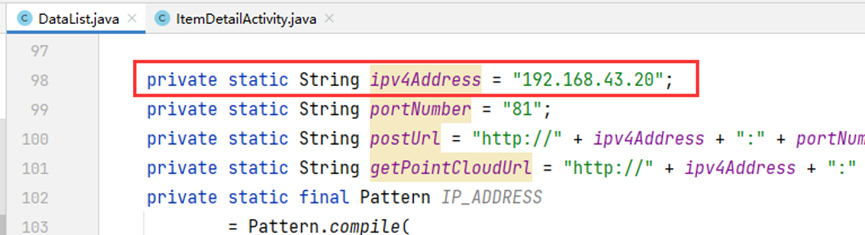
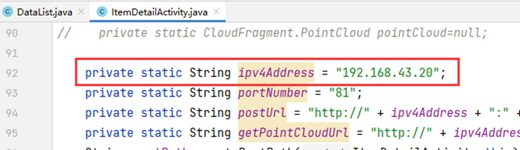

## Requirements
- PyTorch 1.8.1 and above

## Start the backend
Run "python TreeMeasure.py" to start the backend

### Install the app
1. Open the project in Android Studio
2. Change IP address

3. Move the files from the DemoData folder to the root directory of your phone.
4. Install the app on your phone
5. Click the "Obtain data" button at the bottom to retrieve camera parameters.
## Running Video
<video src="Running%20video.mp4" controls title="Title"></video>
